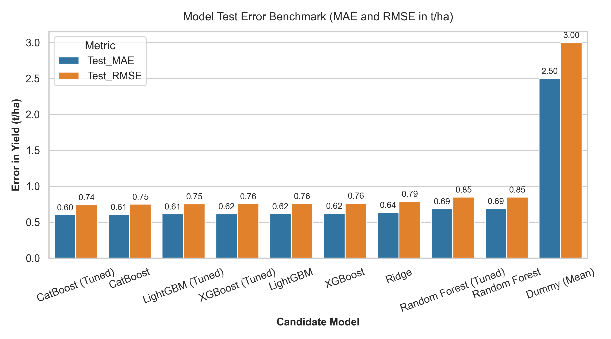
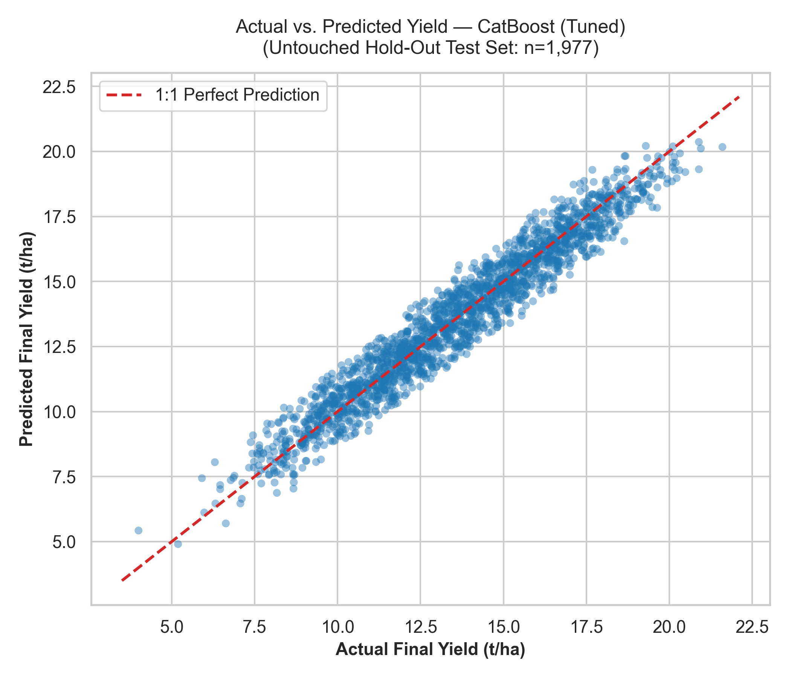
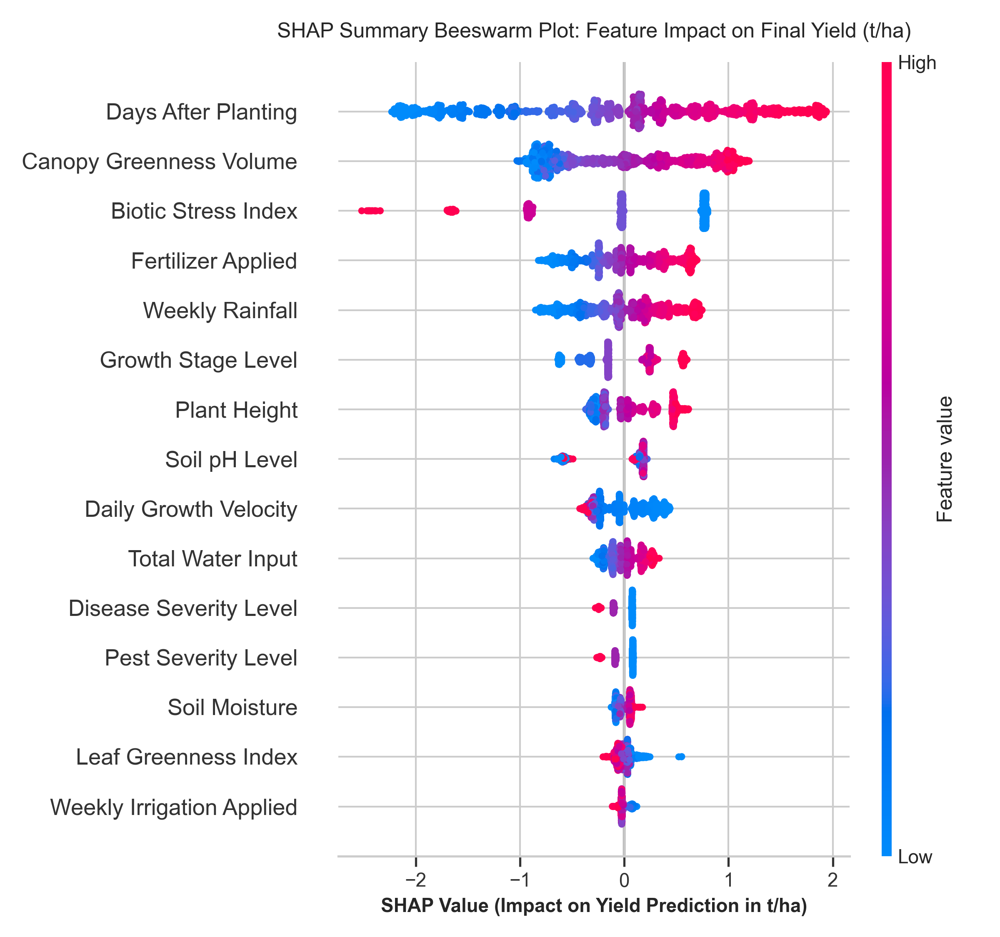
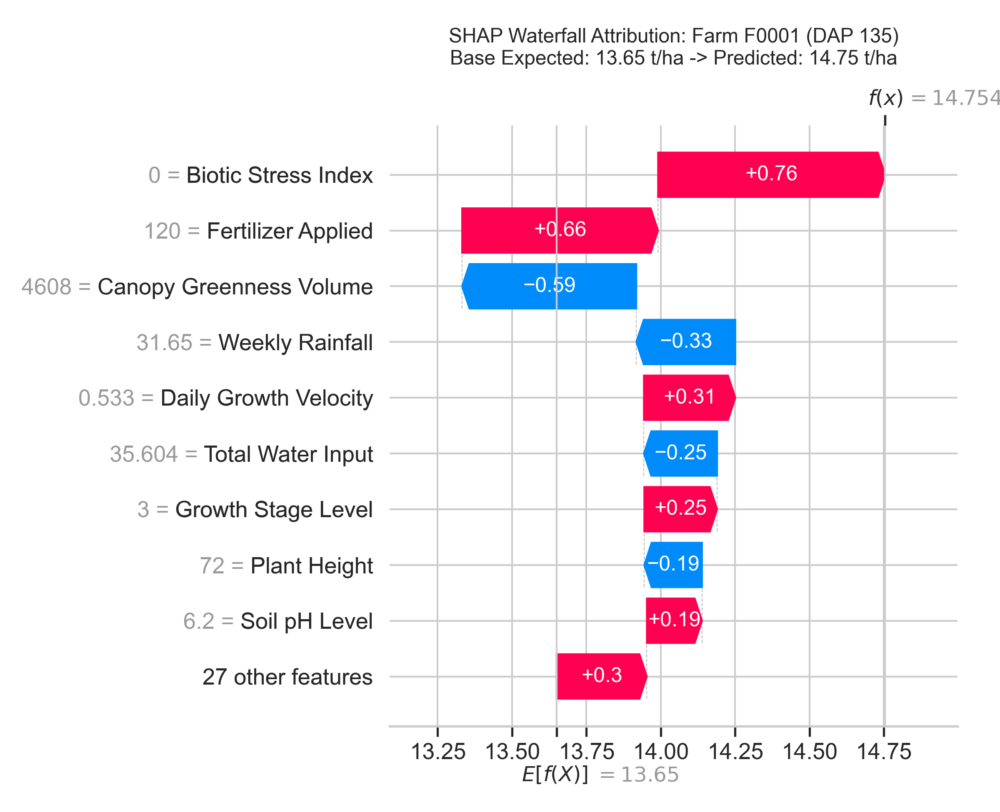
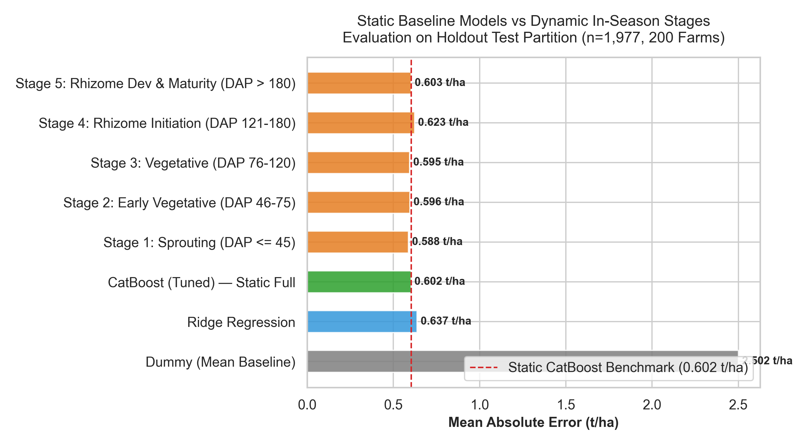
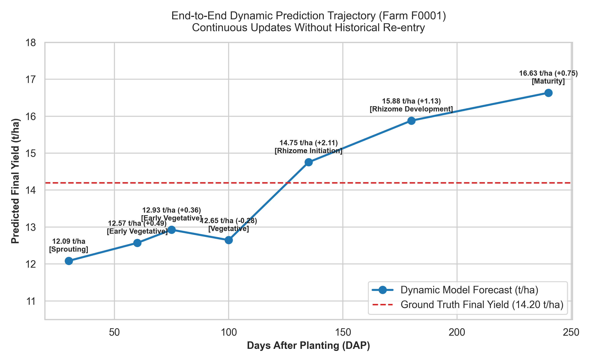

# An Explainable AI-Based Dynamic In-Season Ginger Yield Prediction System for Sri Lankan Farmers

[](https://www.python.org/)
[](tests/)
[](results/model_comparison.csv)
[](LICENSE)
[](src/ui/app.py)

**Academic Module**: Research Methods and Scientific Writing (IT41012)  
**Project Type**: Undergraduate Research Project & Applied ML System  
**Validation Status**: All 7 Development Phases Completed | 110 Automated Tests Passing (100% Pass Rate) | Zero Data Leakage Verified

---

## Table of Contents
1. [Overview & Problem Statement](#overview--problem-statement)
2. [Key Features](#key-features)
3. [System Architecture](#system-architecture)
4. [How It Works](#how-it-works)
5. [AI/ML Methodology](#aiml-methodology)
6. [Empirical Model Performance](#empirical-model-performance)
7. [Explainable AI (XAI) & Farmer Translation](#explainable-ai-xai--farmer-translation)
8. [Dynamic Prediction Trajectory & Statistical Validation](#dynamic-prediction-trajectory--statistical-validation)
9. [Interactive Streamlit Prototype](#interactive-streamlit-prototype)
10. [Repository Structure](#repository-structure)
11. [Installation & Setup](#installation--setup)
12. [Usage Guide](#usage-guide)
13. [Testing & Quality Assurance](#testing--quality-assurance)
14. [Dataset & Provenance Taxonomy](#dataset--provenance-taxonomy)
15. [Limitations & Research Assumptions](#limitations--research-assumptions)
16. [License](#license)

---

## Overview & Problem Statement

Ginger (*Zingiber officinale*) is a high-value cash crop cultivated in Sri Lanka's intermediate and wet zones (primarily across Kandy, Kurunegala, Matale, Badulla, Kegalle, Galle, Matara, Ratnapura, Monaragala, and Nuwara Eliya). Smallholder farmers face significant harvest uncertainty driven by monsoon rainfall variability, localized microclimates, suboptimal irrigation scheduling, and vulnerability to rhizome soft rot (*Pythium spp.*) and shoot borers.

Conventional yield prediction methods rely on post-harvest statistical reporting or static machine learning models that require full-season data upfront. These static models prevent timely, in-season remedial interventions (e.g., supplemental irrigation, nutrient application, pest suppression). Furthermore, existing ML yield predictors often function as "black boxes," lacking interpretable explanations that build farmer trust and enable actionable decisions.

This project implements an Explainable AI (XAI)-based Dynamic In-Season Ginger Yield Prediction prototype specifically designed for Sri Lankan smallholder farming conditions.

---

## Key Features

- **Dynamic In-Season Forecasting**: Reconstructs farm state and produces updated final harvest forecasts ($t/ha$ and total $kg$ for the farm's acreage) whenever new crop observations or irrigation events are recorded, tracking prediction deltas ($\Delta$).
- **Zero Physical Hardware / IoT Requirement**: Operates completely in software using farmer-reported scouting observations, water pump runtime logs, and automated Open-Meteo meteorological API ingestion.
- **Farmer-Friendly Irrigation Conversion**: Farmers log accessible pump operating hours (or minutes); the system automatically calculates water volume ($L$) and effective depth ($mm$) if pump capacity is known, or preserves runtime as an observable feature.
- **Game-Theoretic XAI (TreeSHAP)**: Deconstructs model forecasts into additive feature attributions ($\phi_i$) with verified mathematical additivity ($\epsilon < 10^{-13}\text{ t/ha}$).
- **Non-Causal Plain-Language Farmer Narratives**: Translates technical SHAP attributions into accessible language, strictly separating mathematical association from biological causation.
- **Rule-Based Decision Support**: Provides context-aware agricultural advisories (e.g., withholding supplemental irrigation when 7-day rainfall $\ge 50\text{ mm}$ to prevent rhizome fungal rot).
- **Zero Data Leakage Architecture**: Enforces temporal isolation ($t \le \text{observation date}$) and GroupShuffleSplit partitioning on unique `Farm_ID`s to guarantee 0% train/test farm overlap.
- **Persistent Farm Storage**: File-based JSON repository preserves farm profiles, longitudinal scouting records, irrigation logs, and prediction histories across sessions.

---

## System Architecture

```
[Farmer Web Interface / Streamlit UI]
   │
   ├── 1. Farm Profile Registration (District, Variety, Soil Type, Acreage, Pump Capacity)
   ├── 2. Crop Scouting Observation (Height, SPAD Greenness, Pest/Disease Severity, Soil Moisture)
   └── 3. Irrigation Event Log (Pump Runtime Hours/Mins, Water Source, Method)
          │
          ▼
[Weather Provider Abstraction Layer] ──► Open-Meteo Historical Archive API (or Mock Simulator)
          │                              (Ingests 7-day cumulative rainfall, temp, RH, solar radiation)
          ▼
[Farm State Manager & Farm Repository] (JSON Persistence under data/farms/)
          │
          ├── Strict Temporal Filtering (Rejects all records with timestamp > observation date t)
          ▼
[Feature Engineering & Transformation Pipeline]
          ├── In-Season Mathematical Transformations (Total Water, Growth Velocity, Canopy Volume, Biotic Stress)
          ├── Nominal One-Hot Encoding (10 Districts, 3 Seed Varieties, 3 Soil Types)
          └── Ordinal Value Mappings (Growth Stage 0-5, Pest 0-2, Disease 0-2)
          │
          ▼
[Trained CatBoost Regression Model] (Serialized artifact: models/best_model.joblib)
          │
          ├── Output 1: Updated Final Harvest Prediction (t/ha & Total kg for acreage)
          ├── Output 2: Prediction Delta & Directional Shift Analysis (Δ t/ha, Δ %)
          ├── Output 3: TreeSHAP Feature Attribution Matrix (Base Expected Value + Σ φ_i)
          ├── Output 4: Plain-Language Farmer Narrative (Supporting vs. Limiting Factors)
          └── Output 5: Rule-Based Actionable Recommendations (IPM alerts, water management)
```

---

## How It Works

### 1. Dynamic Prediction Concept
**"Dynamic"** means that whenever new or current farm information becomes available at any point during cultivation, the system incorporates the newly provided observation, updates the current farm state, and immediately generates an updated final ginger yield prediction ($t/ha$).

Dynamic prediction does not require full historical re-entry; previous records are preserved in the `FarmStateManager` and appended with the new observation.

### 2. Farmer-Friendly Irrigation Input & Mathematical Conversion
To avoid burdening farmers with complex volumetric calculations, the system records pump operating runtime:
- **Did you irrigate?**: Yes / No
- **Irrigation Date**: `YYYY-MM-DD`
- **Pump Running Time**: Duration in hours (or minutes)
- **Water Source**: Well / Stream / Rainwater Tank / Canal
- **Irrigation Method**: Sprinkler / Drip / Hose-Manual / Flood

When pump capacity is known in the farm profile:
$$\text{Water Volume (L)} = \text{Pump Runtime (hours)} \times \text{Pump Capacity (L/h)}$$
$$\text{Cultivated Area } (m^2) = \text{Land Size (Acres)} \times 4046.86\text{ } m^2/\text{acre}$$
$$\text{Estimated Irrigation Depth (mm)} = \frac{\text{Water Volume (L)}}{\text{Cultivated Area } (m^2)} \quad (\text{since } 1\text{ mm} = 1\text{ L}/m^2)$$

If pump capacity is unknown, the system retains **`Pump_Runtime_Hours`** directly as an observable feature.

---

## AI/ML Methodology

### 1. Feature Engineering
The model operates on **36 predictive features**:
- **12 Raw Numerical Features**: `Days_After_Planting`, `Land_Size_Acres`, `Soil_pH`, `Soil_Moisture_pct`, `Weekly_Rainfall_mm`, `Avg_Temperature_C`, `Relative_Humidity_pct`, `Solar_Radiation_MJ_m2_day`, `Irrigation_mm_week`, `Fertilizer_kg_acre`, `Plant_Height_cm`, `Leaf_Greenness_Index`.
- **5 In-Season Engineered Features**:
  1. `Total_Water_Input_mm` = $\text{Weekly\_Rainfall\_mm} + \text{Irrigation\_mm\_week}$
  2. `Plant_Height_per_DAP` = $\text{Plant\_Height\_cm} / \text{Days\_After\_Planting}$ (Growth velocity)
  3. `Canopy_Greenness_Volume` = $\text{Plant\_Height\_cm} \times \text{Leaf\_Greenness\_Index}$ (Photosynthetic proxy)
  4. `Biotic_Stress_Index` = $\text{Pest\_Severity\_Ordinal} + \text{Disease\_Severity\_Ordinal}$ (Score: 0 to 4)
  5. `Planting_Month` = Calendar month extracted from `Planting_Date` (Monsoon seasonality proxy)
- **3 Ordinal Encodings**: `Growth_Stage_Ordinal` (0 to 5), `Pest_Severity_Ordinal` (0 to 2), `Disease_Severity_Ordinal` (0 to 2).
- **16 One-Hot Dummies**: 10 Districts, 3 Seed Varieties (`Chinese`, `Local`, `Nadun`), 3 Soil Types (`Clay Loam`, `Loam`, `Sandy Loam`).

### 2. Group-Aware Partitioning & Cross-Validation
- **Hold-Out Split**: 80% Training ($n=8,023$ across 800 unique farms) and 20% Testing ($n=1,977$ across 200 unique farms) partitioned via `GroupShuffleSplit` on `Farm_ID`.
- **Zero Group Overlap**: Guaranteed 0% farm overlap between training and testing splits.
- **Internal Cross-Validation**: 5-Fold `GroupKFold` cross-validation on the 800 training farms.

---

## Empirical Model Performance

### Static Full-Season Benchmark Comparison

Evaluated on the untouched hold-out test set ($n=1,977$ observations across 200 distinct test farms):

| Model | 5-Fold CV MAE ($t/ha$) | Test MAE ($t/ha$) | Test RMSE ($t/ha$) | Test $R^2$ | Test MAPE (%) |
| :--- | :---: | :---: | :---: | :---: | :---: |
| **CatBoost (Tuned)** *(Selected Best)* | **$0.6167 \pm 0.0064$** | **0.6022** | **0.7431** | **0.9386** | **4.68%** |
| **LightGBM (Tuned)** | $0.6341 \pm 0.0106$ | 0.6149 | 0.7545 | 0.9367 | 4.79% |
| **XGBoost (Tuned)** | $0.6340 \pm 0.0114$ | 0.6167 | 0.7561 | 0.9364 | 4.80% |
| **Ridge Regression** | $0.6563 \pm 0.0095$ | 0.6374 | 0.7893 | 0.9307 | 4.97% |
| **Random Forest (Tuned)** | $0.7056 \pm 0.0109$ | 0.6879 | 0.8492 | 0.9198 | 5.41% |
| **Dummy (Mean Baseline)** | $2.5067 \pm 0.0189$ | 2.5016 | 2.9990 | -0.0003 | 20.35% |

### Evaluation Visualizations

| Model Performance Comparison | Actual vs. Predicted Yield |
| :---: | :---: |
|  |  |

---

## Explainable AI (XAI) & Farmer Translation

The system computes local and global feature attributions using game-theoretic Shapley values (TreeSHAP) on the CatBoost regressor:

$$\hat{y} = \phi_0 + \sum_{i=1}^{M} \phi_i$$

Where:
- $\phi_0 = 13.6497\text{ t/ha}$ (Global base expected yield).
- $\phi_i$ is the additive attribution of feature $i$.
- Verified max reconstruction error: $\epsilon < 1.07 \times 10^{-14}\text{ t/ha}$.

### Scientific Boundary: Prediction ≠ Explanation ≠ Causation
- **Prediction**: Quantitative numerical output ($\hat{y}$) from the regression model.
- **Explanation**: Additive feature attribution ($\phi_i$) quantifying how much each input shifted the forecast from the baseline.
- **Causation**: SHAP values explain **model behavior**, not biological cause-and-effect. All translations use strictly non-causal phrasing (*"associated with prediction change"*, *"supporting the prediction"*).

| Global Feature Importance (Beeswarm) | Local Instance Attribution (Waterfall) |
| :---: | :---: |
|  |  |

---

## Dynamic Prediction Trajectory & Statistical Validation

### Developmental Growth Stage Accuracy

Evaluated across developmental checkpoints on hold-out test farms ($n=1,977$, 200 farms):

| Growth Stage Horizon | DAP Range | Test Samples | Test Farms | MAE ($t/ha$) | RMSE ($t/ha$) | $R^2$ Score | MAPE (%) | MAE ($kg/ha$) |
| :--- | :---: | :---: | :---: | :---: | :---: | :---: | :---: | :---: |
| **Stage 1: Sprouting** | $1 - 45$ | 313 | 152 | **0.5877** | 0.7349 | 0.7705 | 6.24% | **587.7** |
| **Stage 2: Early Vegetative** | $46 - 75$ | 202 | 125 | **0.5962** | 0.7323 | 0.7281 | 5.55% | **596.2** |
| **Stage 3: Vegetative** | $76 - 120$ | 316 | 158 | **0.5949** | 0.7332 | 0.7865 | 4.91% | **594.9** |
| **Stage 4: Rhizome Initiation** | $121 - 180$ | 358 | 163 | **0.6229** | 0.7741 | 0.7498 | 4.69% | **622.9** |
| **Stage 5: Rhizome Dev & Maturity** | $181 - 365$ | 788 | 200 | **0.6030** | 0.7388 | 0.8347 | **3.75%** | **603.0** |

### Statistical Significance of In-Season Updates
- Evaluated on $n=1,777$ consecutive in-season farm update transitions.
- **Paired t-test**: $t = 16.92$, $p = 1.10 \times 10^{-59}$ (Confirms statistically significant error reduction as in-season data accumulates).

| Static vs. Dynamic Progression | End-to-End Prediction Trajectory |
| :---: | :---: |
|  |  |

---

## Interactive Streamlit Prototype

The project includes an accessible Streamlit web application for farmers, extension officers, and researchers:

- **Farm Dashboard**: Displays expected harvest in total kilograms ($kg$) for the farmer's acreage, current growth stage, plant height velocity, recent irrigation runtime, plain-language agronomic summary, and dynamic trajectory chart.
- **Crop Observation Logging**: Ingests new scouting measurements (height, SPAD greenness, pest/disease severity) and automatically calculates DAP.
- **Farmer Irrigation Logging**: Ingests pump runtime (hours/minutes), water source, and method.
- **Explainability Explorer**: Interactive TreeSHAP waterfall charts, positive vs. negative factor breakdowns, and plain-language translations.
- **Farm Profile Management**: Create, edit, and switch between multi-district farm profiles with persistent JSON storage.

> **Streamlit UI Interface Demonstration**:  
> Launch locally with `python main.py --ui` or `streamlit run src/ui/app.py`.  
> *(Screenshot placeholder: An interactive screenshot of the active Streamlit dashboard will be attached here upon deployment).*

---

## Repository Structure

```
ginger-yield-prediction/
├── .github/
│   └── workflows/
│       └── ci.yml                         # Automated GitHub Actions CI workflow (pytest on Python 3.10-3.12)
├── data/
│   ├── farms/                             # Persistent JSON farm records (F0001.json, etc.)
│   ├── processed/
│   │   └── ginger_processed.csv           # Preprocessed & engineered dataset (10,000 × 46)
│   └── raw/
│       └── ginger_dataset.csv             # Immutable raw research dataset (10,000 × 22)
├── models/
│   ├── best_model.joblib                  # Serialized CatBoost tuned regressor (R²=0.9386, MAE=0.6022 t/ha)
│   ├── catboost_model.joblib
│   ├── lightgbm_model.joblib
│   ├── random_forest_model.joblib
│   ├── ridge_model.joblib
│   └── xgboost_model.joblib
├── results/
│   ├── explainability/                    # SHAP global rankings, factor contributions, farmer narratives
│   ├── phase6/                            # End-to-end integration demo CSVs and reports
│   ├── phase7/                            # Checkpoint evaluations, leakage audits, statistical tests
│   ├── plots/                             # 26 publication-ready research visualization figures
│   ├── cross_validation_results.csv       # 5-fold CV results
│   ├── final_test_results.csv             # Hold-out test set metrics
│   ├── hyperparameter_results.csv         # Randomized search tuning results
│   └── model_comparison.csv               # Full model benchmark comparison table
├── scripts/
│   ├── demo_end_to_end.py                 # Full integrated demonstration (Phase 6)
│   ├── evaluate.py                        # Standalone evaluation of best_model.joblib
│   ├── evaluate_dynamic_prediction.py     # Checkpoint evaluation across growth horizons (Phase 4)
│   ├── explain_predictions.py             # TreeSHAP attribution & farmer explanation generator (Phase 5)
│   ├── inspect_data.py                    # Exploratory data inspection & quality audit (Phase 1)
│   ├── prepare_data.py                    # Preprocessing & feature engineering (Phase 2)
│   ├── run_app.py                         # Streamlit application launcher
│   ├── run_phase7_evaluation.py           # Master Phase 7 scientific evaluation protocol
│   ├── simulate_dynamic_prediction.py     # Longitudinal farm update simulator
│   └── train.py                           # Model training, GroupKFold CV & hyperparameter tuning
├── src/
│   ├── data/
│   │   ├── data_inspection.py             # Data quality & distribution inspections
│   │   ├── data_loader.py                 # Schema validation & raw data loading
│   │   ├── farm_state.py                  # FarmStateManager, CropObservation, FarmProfile, PredictionHistory
│   │   ├── feature_engineering.py         # In-season feature transformations
│   │   ├── irrigation.py                  # IrrigationEventLog & pump runtime conversions
│   │   ├── preprocessing.py               # Encodings, GroupShuffleSplit & leakage filters
│   │   └── weather_api.py                 # Open-Meteo HTTP provider & Mock simulator
│   ├── dynamic/
│   │   ├── dynamic_evaluator.py           # Growth horizon checkpoint evaluator
│   │   ├── dynamic_predictor.py           # Dynamic prediction coordinator & delta tracking
│   │   └── state_updater.py               # Functional state updater & predictor bridge
│   ├── evaluation/
│   │   └── phase7_evaluator.py            # Master scientific research evaluation suite
│   ├── explainability/
│   │   ├── explanation_model.py           # Dataclasses for contributions & explanations
│   │   ├── farmer_translator.py           # Plain-language agronomic translation layer
│   │   ├── recommendations.py             # Rule-based agricultural recommendation engine
│   │   └── shap_explainer.py              # TreeSHAP computation engine & plot visualizers
│   ├── models/
│   │   ├── evaluation.py                  # Regression metrics & residuals calculations
│   │   ├── predictor.py                   # GingerYieldPredictor inference class
│   │   └── train_models.py                # Candidate model constructors & tuning routines
│   ├── storage/
│   │   └── farm_repository.py             # JSON persistence layer for farm states
│   ├── ui/
│   │   └── app.py                         # Streamlit interactive web dashboard
│   └── utils/
│       ├── config.py                      # Central paths, district coordinates, validation bounds
│       └── units.py                       # Acreage and kg/t unit conversion utilities
├── tests/                                 # 11 test modules (110 automated tests)
├── .gitignore                             # Clean Git ignore specification
├── LICENSE                                # MIT License
├── main.py                                # Master Command-Line Interface (CLI)
├── pyproject.toml                         # Project configuration & pytest settings
└── requirements.txt                       # Python dependencies
```

---

## Installation & Setup

### Prerequisites
- Python **3.10**, **3.11**, **3.12**, or **3.13**
- Git

### Quickstart

```bash
# 1. Clone the repository
git clone https://github.com/<your-username>/ginger-yield-prediction.git
cd ginger-yield-prediction

# 2. Create and activate a virtual environment
python -m venv venv
# On Windows:
venv\Scripts\activate
# On macOS/Linux:
source venv/bin/activate

# 3. Install required dependencies
pip install --upgrade pip
pip install -r requirements.txt

# 4. Run automated test suite to verify installation
pytest
```

---

## Usage Guide

The system provides a unified command-line entry point via `main.py`:

```bash
# Display all available options
python main.py --help

# 1. Inspect raw data and export exploratory statistics (Phase 1)
python main.py --inspect

# 2. Preprocess dataset and engineer in-season features (Phase 2)
python main.py --prepare

# 3. Train all candidate models and perform hyperparameter tuning (Phase 3)
python main.py --train

# 4. Evaluate saved best model artifact on hold-out test set
python main.py --evaluate

# 5. Evaluate dynamic accuracy across growth stage horizons (Phase 4)
python main.py --dynamic

# 6. Simulate a longitudinal in-season crop update trajectory
python main.py --simulate

# 7. Generate TreeSHAP attributions and farmer translations (Phase 5)
python main.py --explain

# 8. Run end-to-end system integration demonstration (Phase 6)
python main.py --demo

# 9. Run master scientific validation suite and export reports (Phase 7)
python main.py --phase7

# 10. Launch the interactive Streamlit web dashboard
python main.py --ui

# 11. Run the entire research reproduction pipeline end-to-end
python main.py --pipeline
```

---

## Testing & Quality Assurance

The repository includes a comprehensive automated test suite of **110 tests** covering data loading, feature engineering, group-aware cross-validation, model inference, dynamic state management, TreeSHAP additivity, rule-based recommendations, JSON persistence, and Streamlit UI components:

```bash
# Run full test suite with verbose output
pytest -v

# Run specific test modules
pytest tests/test_models.py
pytest tests/test_dynamic_state.py
pytest tests/test_explainability.py
pytest tests/test_phase7_evaluation.py
```

### Verified Test Summary:
```
============================= 110 passed in 24.22s =============================
```

---

## Dataset & Provenance Taxonomy

The dataset comprises **10,000 observations** across **1,000 distinct farms** representing Sri Lanka's primary ginger-cultivating districts. Every data point is tagged with an explicit provenance taxonomy:

- **`FARMER_REPORTED`**: Direct farmer-observable crop parameters (shoot height, leaf greenness index, pest severity, disease severity, pump runtime).
- **`API_DERIVED`**: Meteorological data ingested via Open-Meteo Historical Archive API (precipitation, temperature, humidity, solar radiation).
- **`HISTORICAL_DATASET`**: Baseline records from the research dataset.
- **`SYNTHETIC_SIMULATED`**: Simulated experimental data for offline validation.

---

## Limitations & Research Assumptions

1. **Synthetic Experimental Baseline**: The primary 10,000-row research dataset contains cross-sectionally sampled synthetic observations representing Sri Lankan agro-ecological distributions.
2. **Weekly Aggregation**: Environmental data is aggregated over 7-day retrospective windows ending on observation date $t$, rather than continuous hourly sensor logs.
3. **Non-Causal Interpretability**: TreeSHAP values reflect mathematical statistical association within the CatBoost model and should not be interpreted as proven biological causation.

---

## License

This project is licensed under the **MIT License** - see the [LICENSE](LICENSE) file for details.
